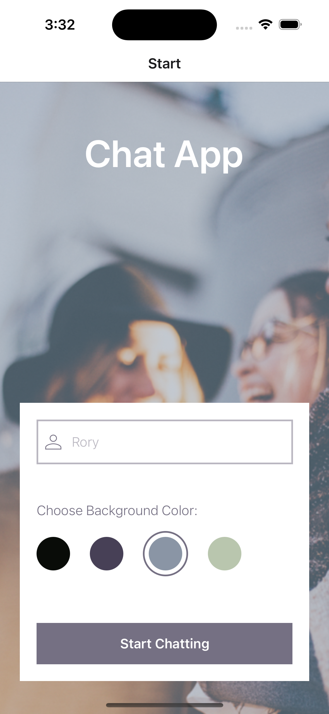

# Chat App

Chat App is an interactive, real-time messaging application developed using React Native. It offers a user-friendly platform for engaging conversations.

## Features

- **Real-time chat**: Send and receive messages instantly across the platform.
- **Offline support**: Continue chatting even when you lose your internet connection.
- **User presence system**: See when a new user enters the chat.
- **Customizable user interface**: Choose your username and select a background color for your chat screen to personalize your chat experience.
- **Location sharing**: Share your current location with other users in the chat.
- **Image sharing**: Share images with other users in the chat.

## Screenshots




## Demo


## Installation

```bash
# Clone the repository
git clone https://github.com/yourusername/chat-app.git

# Navigate to the project directory
cd chat-app

# Install the dependencies
npm install

# Start the application
npm start
```

## Configuration

1. Create a new project on Firebase.
2. Add a new web app to your Firebase project.
3. Copy the Firebase configuration object.
4. Create a `.env` file in the root directory of the project.
5. Add the following environment variables to the `.env` file:

```bash
FIREBASE_API_KEY="your-api-key"
FIREBASE_AUTH_DOMAIN="your-auth-domain"
FIREBASE_PROJECT_ID="your-project-id"
FIREBASE_STORAGE_BUCKET="your-storage-bucket"
FIREBASE_MESSAGING_SENDER_ID="your-messaging-sender-id"
FIREBASE_APP_ID="your-app-id"
FIREBASE_MEASUREMENT_ID="your-measurement-id"
```

6. Enable the Firebase Realtime Database and Firebase Authentication services.
7. Add the following rules to the Firebase Realtime Database:

```javascript
service cloud.firestore {
    match /databases/{database}/documents {
        match /{document=**} {
            allow read, write: if true;
        }
    }
}
```

8. Add the following rules to the Firebase Storage:

```javascript
service firebase.storage {
  match /b/{bucket}/o {
    match /{allPaths=**} {
      allow read, write: if true;
    }
  }
}
```


## Usage

1. Launch the application.
2. Enter your desired username.
3. Select a background color for your chat screen.
4. Click the "Start Chatting" button to begin your chat experience.
5. Use the "+" button to share your location or an image with other users in the chat.

## Dependencies

- React Native
- Expo
- Firebase
- Gifted Chat
- React Native Maps
- React Native Image Picker
- AsyncStorage
- NetInfo
- React Native Action Sheet
- React Native Svg
- React Native Dotenv

## Contributing

Contributions are welcome! For major changes, please open an issue first to discuss what you would like to change.

## License

This project is licensed under the GNU License.

## Contact Information

For any questions or support, please email me at vanblaricom.rory@icloud.com.
